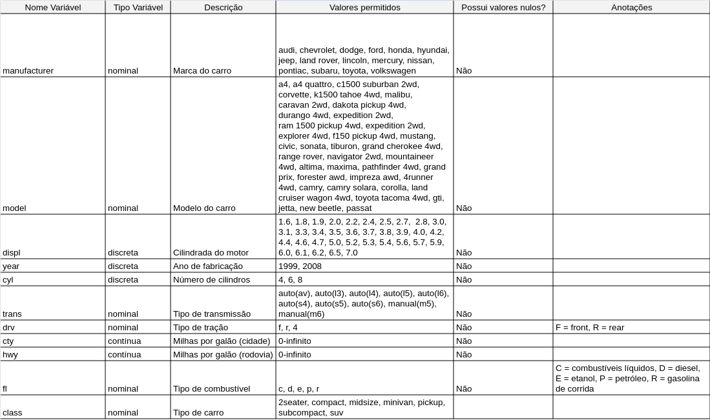

# Resumo

Neste artigo, foi explorada a aplicação de técnicas de Estatística Descritiva na análise exploratória de dados utilizando a linguagem R e o pacote tidyverse. O objetivo principal foi obter insights iniciais sobre um conjunto de dados do mundo real, especificamente o conjunto mpg disponível no pacote ggplot2, que contém informações sobre a economia de combustível de veículos fabricados entre 1999 e 2008.

Utilizando medidas de posição e dispersão, além de gráficos de dispersão, boxplots e histogramas, fez-se uma análise detalhada das variáveis do conjunto de dados. Observou-se uma correlação negativa entre o volume do motor e a eficiência de combustível, consistente com a expectativa de que motores maiores consomem mais combustível. Foi identificado também que a classe 2seater é a mais consistente em termos de economia de combustível, enquanto as classes subcompact e suv apresentam maior variabilidade. Entre as marcas, a Lincoln destacou-se pela menor variação no consumo de combustível.

Os resultados indicam avanços na engenharia automotiva, com melhorias na eficiência de combustível ao longo dos anos, apesar do aumento do tamanho médio dos motores. A análise revelou também outliers notáveis, como o modelo New Beetle da Volkswagen, que apresenta excelente eficiência de combustível.

Este estudo oferece uma base para consumidores e fabricantes avaliarem a eficiência dos veículos e sugere caminhos para futuras pesquisas, incluindo a exploração de técnicas avançadas de modelagem e a análise de dados adicionais para uma compreensão mais completa do desempenho dos veículos.

# Introdução

No contexto da mineração de dados, a quantidade de informações disponíveis frequentemente excede a capacidade humana de análise manual. Por isso, torna-se indispensável o uso de ferramentas que possam fornecer insights iniciais sobre os dados, auxiliando na escolha das abordagens mais adequadas para a mineração propriamente dita.

Uma das ferramentas mais valiosas para esse propósito é a Estatística Descritiva, que permite determinar medidas de dispersão, frequência e correlação dos dados, além de ajudar na detecção de anomalias e incosistências no conjunto de valores. Esses resultados podem ser visualizados de maneira mais intuitiva por meio de gráficos, o que contribui significativamente para o processo de análise exploratória dos dados.

Com isso em mente, o presente artigo tem como objetivo explorar o uso das ferramentas da Estatística Descritiva na fase de análise exploratória de um conjunto de dados do mundo real, utilizando a linguagem R e o pacote complementar tidyverse.

# Metodologia

Nesta análise, utilizou-se o conjunto de dados mpg, disponível no pacote ggplot2 e acessível através do endereço fueleconomy.gov. Esse conjunto contém informações sobre a economia de combustível coletadas pela EPA (Environmental Protection Agency - USA), a agência responsável pela proteção da saúde humana e do meio ambiente. Os dados abrangem modelos de carros lançados anualmente no período de 1999 a 2008. O *data frame* é composto por 234 observações e 11 variáveis: manufacturer, model, displ, year, cyl, trans, drv, cty, hwy, fl, e class. O dicionário das variáveis pode ser encontrado no Apêndice.

O objetivo desta análise foi aplicar conceitos da Estatística Descritiva para obter insights iniciais sobre os dados durante a fase de análise exploratória. Para isso, utilizou-se a linguagem R e suas funções básicas, que permitiram o cálculo de medidas importantes, como amplitude, variância, desvio padrão, média, mediana, coeficiente de variação e coeficiente de correlação de Pearson. Além das funções básicas da R, o pacote tidyverse, que inclui pacotes como ggplot2 e dplyr, foi empregado para a criação de gráficos e manipulação dos dados. Para a documentação do processo, utilizou-se o R Markdown, e o ambiente de trabalho escolhido foi a IDE RStudio. A escolha dessas ferramentas se deu pela gratuidade, código aberto, integração de funcionalidades úteis e facilidade de uso.

Esses métodos foram apropriados, pois permitiram a aplicação prática da teoria da Estatística Descritiva no contexto da análise exploratória de dados, uma etapa indispensável no escopo da mineração de dados.

# Análise Exploratória dos Dados

O conjunto de dados mpg, utilizado para a pesquisa, está disponível no pacote ggplot2 (versão 3.5.1), o qual foi carregado juntamento com os demais pacotes que compõem o tidyverse utilizando o comando:

```{r, message=FALSE}
library(tidyverse)
```
Para garantir a boa visualização dos gráficos mesmo para pessoas com deficiência de visão de cores, utiliza-se a paleta de cores do pacote viridis:

```{r}
library(viridis)
```

Uma visualização inicial do dataset permite uma visão geral das variáveis que compõem os dados, e foi possível alcançar isso com o comando:

```{r}
glimpse(mpg)
```

Como é possível notar, estão presentes as 11 variáveis citadas anteriormente que compõem o dataset, sendo algumas delas nominais e outras numéricas.

Além disso, para uma análise inicial, é interessante visualizar um gráfico de pontos com as variáveis displ, hwy e class, uma vez que é possível inferir, pelo conhecimento do funcionamento dos motores veiculares atuais, que possivelmente há uma correlação entre as variáveis displ e hwy:

```{r}
ggplot(mpg, aes(displ, hwy, color = class, shape = class)) + 
  geom_point() +
  scale_color_viridis(discrete = TRUE) +
  scale_shape_manual(values = 1:7)
```

Verifica-se a existência de um coeficiente de correlação negativo aparente entre displ e hwy, uma vez que o aumento da displ leva à queda da hwy, o que já era de se esperar, pois motores com cilindros de maior volume tendem a gastar mais combustível. Porém, pode-se notar que alguns veículos da classe 2seater se comportam de maneira diferente da usual, pois mesmo tendo motores com grande volume, ainda conseguem uma boa eficiência de combustível. Existem também dois veículos da classe subcompact que se sobressaem aos demais no quesito economia de combustível.

Para uma visualização mais focada nessa duas classes, foi possível criar um subdataset que contém apenas os veículos das classes 2seater e subcompact ao fazer o uso da função filter disponível no pacote dplyr:

```{r}
mpg_2seater_subcompact <- filter(mpg, class == "2seater" | class == "subcompact")
```

Tendo o subconjunto, utilizou-se o gráfico boxplot para uma sumarização dos dados relativos aos mesmos:

```{r, echo=FALSE}
ggplot(mpg_2seater_subcompact, aes(x = class, y = hwy)) + 
  geom_boxplot()
```

É possível observar com bastante clareza a presença de dois outliers dentre os carros da classe subcompact. Além disso, a classe subcompact apresenta um range maior de valores da variável hwy, enquanto a 2seater fica mais concentrada. Isso será constatado posteriormente com o uso das medidas de dispersão.

Para aproveitar a sumarização fornecida pelo gráfico boxplot, é válido visualizar todas as classes utilizando esse recurso:

```{r}
ggplot(mpg, aes(x = class, y = hwy)) + 
  geom_boxplot()
```

Dessa maneira, obteve-se uma visão geral de todas as classes, sobre as quais foram feitas análises mais aprofundadas posteriormente.

Ainda, foi criado um histograma para ilustrar a distribuição de frequência dos valores de hwy, divididos em 9 classes, seguindo a regra de Sturges, na qual o número de classes é dado por **k = 1 + 3.3 log n**, onde n equivale ao número de observações, nesse caso 234.

```{r}
ggplot(mpg, aes(x = hwy)) + 
  geom_histogram(bins = 9, color="black", fill="white")
```

Dessa forma, foi possível constatar que os dados não seguem a distribuição normal no que se refere aos valores de hwy.

# Análise Estatística Descritiva

Iniciando a análise com menor granularidade, analisa-se quais classes são mais "consistentes", e para isso, como existem classes de carros com diferentes médias de consumo (hwy), será utilizado o valor calculado do Coeficiente de Variação de Pearson para comparação. Quanto menor for esse CV, menos os dados variam em torno da média.

Para tal análise, são criados os subconjuntos das classes:

```{r}
mpg_2seater <- filter(mpg, class == "2seater")
mpg_compact <- filter(mpg, class == "compact")
mpg_midsize <- filter(mpg, class == "midsize")
mpg_minivan <- filter(mpg, class == "minivan")
mpg_pickup <- filter(mpg, class == "pickup")
mpg_subcompact <- filter(mpg, class == "subcompact")
mpg_suv <- filter(mpg, class == "suv")
```


O gráfico de boxplot mostrado anteriormente volta a ser relevante, para termos uma representação visual da sumarização das classes:

```{r, echo=FALSE}
ggplot(mpg, aes(x = class, y = hwy)) + 
  geom_boxplot()
```

Para o cálculo do desvio padrão de cada classe, faz-se o uso da função **sd** presente no pacote **stats**, nativo do R:

```{r}
library(stats)
desvio_padrao_2seater <- sd(mpg_2seater$hwy)
desvio_padrao_compact <- sd(mpg_compact$hwy)
desvio_padrao_midsize <- sd(mpg_midsize$hwy)
desvio_padrao_minivan <- sd(mpg_minivan$hwy)
desvio_padrao_pickup <- sd(mpg_pickup$hwy)
desvio_padrao_subcompact <- sd(mpg_subcompact$hwy)
desvio_padrao_suv <- sd(mpg_suv$hwy)
```

Para uma melhor visualização dos resultados, cria-se uma tabela com:

```{r}
tabela_desvio_padrao <- data.frame(class = c("2seater", "compact", "midsize", "minivan",
                                             "pickup", "subcompact", "suv"),
                                   desvio_padrao = c(desvio_padrao_2seater, desvio_padrao_compact,
                                              desvio_padrao_midsize, desvio_padrao_minivan,
                                              desvio_padrao_pickup, desvio_padrao_subcompact,
                                              desvio_padrao_suv))

print(tabela_desvio_padrao)
```

Agora, pode-se calcular o CV de Pearson fazendo:

```{r}
cv_2seater <- desvio_padrao_2seater / mean(mpg_2seater$hwy)
cv_compact <- desvio_padrao_compact / mean(mpg_compact$hwy)
cv_midsize <- desvio_padrao_midsize / mean(mpg_midsize$hwy)
cv_minivan <- desvio_padrao_minivan / mean(mpg_minivan$hwy)
cv_pickup <- desvio_padrao_pickup / mean(mpg_pickup$hwy)
cv_subcompact <- desvio_padrao_subcompact / mean(mpg_subcompact$hwy)
cv_suv <- desvio_padrao_suv / mean(mpg_suv$hwy)

tabela_medidas_dispersao_classes <- tabela_desvio_padrao |> mutate(cv = c(cv_2seater, cv_compact,
                                                                  cv_midsize, cv_minivan,
                                                                  cv_pickup, cv_subcompact,
                                                                  cv_suv) * 100)
print(tabela_medidas_dispersao_classes)
```

Com isso, tem-se os valores desejados e é possível notar que a classe mais consistente é a 2seater, seguida pela midsize. E as duas menos consistentes são as classes subcompact e suv.

Isso significa que uma pessoa interessada em comprar um carro, por exemplo, ao escolher um veículo da classe 2seater, teria uma maior probabilidade de que o consumo girasse em torno da média da categoria, seria uma compra "mais segura".

Entretanto, deve-se ter um cuidado ao afirmar isso, pois tem-se discrepância entre as quantidades de exemplos de cada classe, conforme pode-se notar no gráfico de barras:

```{r}
ggplot(mpg, aes(x = class)) +
  geom_bar(color = "black", fill = "white")
```

Ainda nesse sentido, pode-se analisar o consumo dos carros por marca, fazendo:

```{r}
ggplot(mpg, aes(x = manufacturer, y = hwy)) + 
  geom_boxplot()
```

Nota-se que algumas marcas como Chevrolet, Nissan e Toyota têm veículos com consumos mais diversos, o que pode ser uma consequência do maior número de modelos produzidos por elas. Enquanto os carros da Lincoln e Pontiac não apresentam grande variação no consumo.

No gráfico, também é possível observar que os dois veículos que se sobressaem na economia de combustível são da Volkswagen.

Para uma análise mais detalhada das marcas, cria-se subconjuntos de maneira semelhante às classes:

```{r}
mpg_audi <- filter(mpg, manufacturer == "audi")
mpg_chevrolet <- filter(mpg, manufacturer == "chevrolet")
mpg_dodge <- filter(mpg, manufacturer == "dodge")
mpg_ford <- filter(mpg, manufacturer == "ford")
mpg_honda <- filter(mpg, manufacturer == "honda")
mpg_hyundai <- filter(mpg, manufacturer == "hyundai")
mpg_jeep <- filter(mpg, manufacturer == "jeep")
mpg_land_rover <- filter(mpg, manufacturer == "land rover")
mpg_lincoln <- filter(mpg, manufacturer == "lincoln")
mpg_mercury <- filter(mpg, manufacturer == "mercury")
mpg_nissan <- filter(mpg, manufacturer == "nissan")
mpg_pontiac <- filter(mpg, manufacturer == "pontiac")
mpg_subaru <- filter(mpg, manufacturer == "subaru")
mpg_toyota <- filter(mpg, manufacturer == "toyota")
mpg_volkswagen <- filter(mpg, manufacturer == "volkswagen")

```

Agora, calcula-se o desvio padrão de cada marca com:

```{r}
library(stats)
desvio_padrao_audi <- sd(mpg_audi$hwy)
desvio_padrao_chevrolet <- sd(mpg_chevrolet$hwy)
desvio_padrao_dodge <- sd(mpg_dodge$hwy)
desvio_padrao_ford <- sd(mpg_ford$hwy)
desvio_padrao_honda <- sd(mpg_honda$hwy)
desvio_padrao_hyundai <- sd(mpg_hyundai$hwy)
desvio_padrao_jeep <- sd(mpg_jeep$hwy)
desvio_padrao_land_rover <- sd(mpg_land_rover$hwy)
desvio_padrao_lincoln <- sd(mpg_lincoln$hwy)
desvio_padrao_mercury <- sd(mpg_mercury$hwy)
desvio_padrao_nissan <- sd(mpg_nissan$hwy)
desvio_padrao_pontiac <- sd(mpg_pontiac$hwy)
desvio_padrao_subaru <- sd(mpg_subaru$hwy)
desvio_padrao_toyota <- sd(mpg_toyota$hwy)
desvio_padrao_volkswagen <- sd(mpg_volkswagen$hwy)

tabela_medidas_dispersao_marcas <- data.frame(marca = c("audi", "chevrolet", "dodge", "ford",
                                                        "honda", "hyundai", "jeep", "land rover",
                                                        "lincoln", "mercury", "nissan", "pontiac",
                                                        "subaru", "toyota", "volkswagen"), 
                                              desvio_padrao = c(desvio_padrao_audi,
                                                                desvio_padrao_chevrolet,
                                                                desvio_padrao_dodge,
                                                                desvio_padrao_ford,
                                                                desvio_padrao_honda,
                                                                desvio_padrao_hyundai,
                                                                desvio_padrao_jeep,
                                                                desvio_padrao_land_rover,
                                                                desvio_padrao_lincoln,
                                                                desvio_padrao_mercury,
                                                                desvio_padrao_nissan,
                                                                desvio_padrao_pontiac,
                                                                desvio_padrao_subaru,
                                                                desvio_padrao_toyota,
                                                                desvio_padrao_volkswagen))

print(tabela_medidas_dispersao_marcas)
```

Com esses resultados, podemos notar que a marca que apresentou menor variação em torno da média foi a Lincoln, seguida pela Pontiac. Esses resultados não necessariamente mostram que essas são as marcas mais consistentes, uma vez que tem-se diferentes quantidades de exemplos de cada marca, como pode-se ver ao fazer um gráfico de barras:

```{r}
ggplot(mpg, aes(x = manufacturer)) +
  geom_bar(color = "black", fill = "white")
```

Assim, como tem-se quantidades de exemplos de cada marca, a análise comparativa entre as marcas fica comprometida.

É interessante analisar se existe uma relação entre o ano de fabricação dos veículos e o consumo, para tal fim, cria-se um gráfico de pontos com os anos no eixo x e o consumo no eixo y:

```{r}
ggplot(mpg, aes(year, hwy)) + 
  geom_point()
```

Esse gráfico demonstra que os modelos "mais gastadores" são os mais antigos, isso poderia ser uma consequência do fato de que os motores mais clássicos tendem a ser maiores e menos eficientes. Para investigar essa hipótese, cria-se o gráfico de pontos comparando o ano no eixo x e displ no eixo y:

```{r}
ggplot(mpg, aes(year, displ)) + 
  geom_point()
```

A hipótese mostrou-se infundada, pois não existe uma tendência de diferença na litragem dos motores entre os anos. Para sumarizar essas medidas, pode-se fazer para os carros de 1999:

```{r, echo=FALSE}
mpg_1999 <- filter(mpg, year == 1999)
```

```{r}
print(summary(mpg_1999$displ))
```

E para os carros de 2008:

```{r, echo=FALSE}
mpg_2008 <- filter(mpg, year == 2008)
```

```{r}
print(summary(mpg_2008$displ))
```

Constata-se que na verdade carros mais recentes têm motores com uma média maior de litragem, entretanto tem uma média menor de consumo, o que pode ser explicado pelo avanço da engenharia de motores, que trouxe modelos mais eficientes.

É valido investigar se determinada marca foca sua produção em carros de determinada categoria. Isso pode ser alcançado ao criar o gráfico:

```{r}
ggplot(mpg, aes(manufacturer, class, colour = manufacturer, shape = manufacturer)) + 
  geom_count() +
  scale_color_viridis(discrete = TRUE) +
  scale_shape_manual(values = 1:15)
```

O gráfico mostra que marcar como Chevrolet, Toyota e Volkswagen têm veículos de diversas classes, enquanto Jeep, Land Rover e Mercury são especializadas em SUVs.

Agora, ao analisar o gráfico de pontos que relaciona as variáveis displ e hwy:

```{r, echo=FALSE}
ggplot(mpg, aes(displ, hwy, colour = class, shape = class)) + 
  geom_point() +
  scale_color_viridis(discrete = TRUE) +
  scale_shape_manual(values = 1:7)
```

Nota-se um aparente coeficiente de correlação negativo entre essas variávies, o que pode ser investigado ao fazer o cálculo do coeficiente de Pearson:

```{r}
coef_corr_hwy_disp <- cor(mpg$hwy, mpg$displ)
print(coef_corr_hwy_disp)
```

Como os valores do coeficiente variam de -1 a +1, o valor calculado mostra uma forte correlação negativa entre as duas variáveis, o que já era de se esperar pelo contexto, uma vez que maior litragem em um motor reduz a economia de combustível do mesmo.

Mas, e aqueles outliers presentes na classe subcompact?

```{r}
mpg_subcompact <- filter(mpg, class == "subcompact")
ggplot(mpg_subcompact, aes(x = class, y = hwy)) + 
  geom_boxplot()
```


```{r}
mpg_subcompact_sorted <- mpg_subcompact |>
    arrange(desc(hwy))

head(mpg_subcompact_sorted)
```

Ao ordenar o dataset da classe subcompact de maneira decrescente pelo hwy, pode-se observar que os dois carros que se sobressaem ao demais no quesito economia são do mesmo modelo, New Beetle da Volkswagen, ambos do ano 1999.

# Conclusão

### Resumo dos Resultados

A análise exploratória dos dados do conjunto mpg, utilizando ferramentas da Estatística Descritiva no R, revelou insights significativos sobre o consumo de combustível de veículos fabricados entre 1999 e 2008. Através da aplicação de medidas de posição e dispersão, gráficos de dispersão, boxplots e histogramas, foi possível identificar padrões e anomalias no consumo de combustível (variável hwy) em relação a outras variáveis, como o volume do motor (displ) e a classe dos veículos.

Observou-se uma correlação negativa entre o volume do motor e a eficiência de combustível, consistente com o entendimento de que motores maiores tendem a consumir mais combustível. Além disso, a análise revelou que os veículos da classe 2seater são os mais consistentes em termos de economia de combustível, enquanto as classes subcompact e suv apresentaram maior variabilidade. Entre as marcas, a Lincoln demonstrou menor variação no consumo de combustível, embora essa constatação deva ser contextualizada pela disparidade no número de modelos analisados.

Os outliers identificados na classe subcompact foram principalmente veículos do modelo New Beetle da Volkswagen, destacando-se pela excelente eficiência de combustível, o que pode ser um ponto de interesse para análises futuras.

### Implicações e Relevância

Os resultados obtidos têm implicações práticas para consumidores e fabricantes de veículos. Para os consumidores, a análise pode orientar a escolha de veículos com base na consistência do consumo de combustível dentro de uma categoria específica. Para os fabricantes, os dados sugerem que, ao focar na melhoria da eficiência de combustível, modelos com menor variabilidade em torno da média podem representar uma vantagem competitiva. Além disso, as tendências observadas ao longo dos anos indicam avanços na engenharia automotiva, com motores mais recentes apresentando melhor eficiência, apesar do aumento do tamanho médio dos motores.

### Sugestões para Trabalhos Futuros

Para aprofundar a análise, recomenda-se a exploração de técnicas mais avançadas de análise de dados, como a modelagem estatística e a aprendizagem de máquina, para prever o consumo de combustível com base em múltiplas variáveis simultaneamente. Além disso, a inclusão de dados mais recentes e de outros conjuntos de dados, como informações sobre as emissões de poluentes e custos de manutenção, poderia proporcionar uma visão mais abrangente sobre o desempenho dos veículos.

Explorar variáveis adicionais, como o tipo de combustível e a presença de tecnologias de economia de combustível, também pode agregar valor às análises futuras. A investigação de dados mais granulares, como o desempenho de veículos em diferentes condições de estrada, pode oferecer insights ainda mais detalhados sobre a eficiência e o comportamento dos veículos.

# Referências

ASSUNÇÃO,  Joaquim Vinicius Carvalho. Uma breve introdução à Mineração de Dados: Bases para a ciência de dados, com exemplos em R. 1. ed. São Paulo: Novatec Editora, 2021. ISBN 9786586057508. 

SILVA, Leandro Augusto Da; PERES, Sarajane Marques;  BOSCARIOLI, Clodis. Introdução à Mineração de Dados: Com Aplicações em R. 1. ed. Barueri: GEN LTC, 2016. ISBN 9788535284478.

FONSECA, Jairo Simon Da. Curso de estatística. 6. ed. São Paulo: Atlas, 1996. ISBN  9788522414710.

# Apêndices

### Dicionário de variáveis

```{r, echo=FALSE, out.width='100%', out.height='100%'}

```

